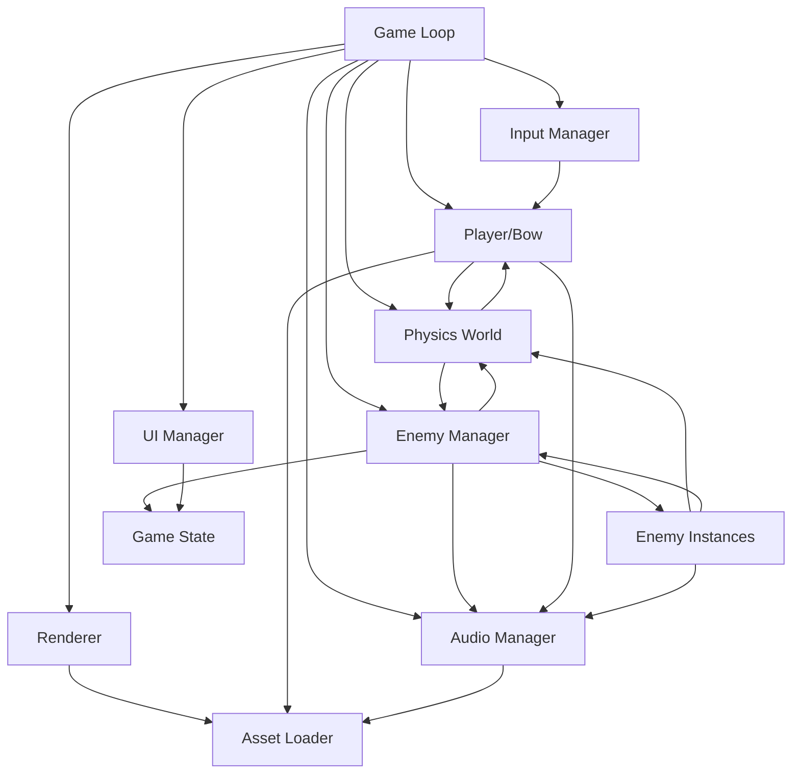
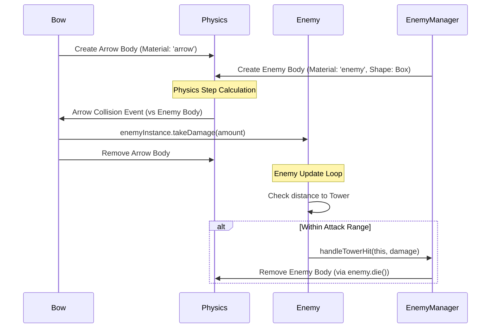

# Architecture Documentation

## Overview
The game follows a modular architecture using ES6 modules. Key systems like Physics, Rendering, Asset Loading, Audio, and Input are separated for clarity. The `Game.js` module acts as the central orchestrator, managing the main loop and coordinating updates between modules.

## Core Module Interactions



## Key System Flows

### 1. Asset Handling
- `AssetLoader` loads GLTF models or generates placeholder meshes (Capsules for enemies, Box/Cylinder for bow/arrow).
- Placeholders are translated so their base rests at Y=0.
- Modules (e.g., `Bow`, `Enemy`) request assets by key from `AssetLoader`.
- **Crucially:** Modules *must clone* the `scene` object from the returned asset data before adding it to the scene graph.
- Scaling is applied *after* cloning, specific to the asset type (e.g., arrows scaled down in `Bow.js`, enemies scaled in `Enemy.js` based on `waveDefinitions`).

```mermaid
flowchart TD
    Start[Request Asset] --> AL(AssetLoader)
    AL -->|GLTF Path| LoadGLTF[Load GLTF]
    AL -->|Null Path| GenPlaceholder[Generate Placeholder]
    LoadGLTF --> StoreAsset[Store { scene, isPlaceholder: false }]
    GenPlaceholder --> StoreAssetP[Store { scene, isPlaceholder: true }]
    StoreAsset --> Requester[Requesting Module]
    StoreAssetP --> Requester
    Requester --> Clone[Clone asset.scene]
    Clone --> Scale[Apply Scaling (if needed)]
    Scale --> AddToScene[Add to Scene/Physics]
```

### 2. Physics & Collision
- `Physics.js` sets up the `CANNON.World`, defines materials (`ground`, `enemy`, `arrow`, `player`/`tower`), and contact interactions.
- Static bodies (ground, tower) are added during initialization.
- Dynamic bodies (`Arrow`, `Enemy`) are created and added by their respective modules (`Bow`, `Enemy`).
- **Enemy Shapes:** `EnemyManager` dynamically determines the physics shape. For placeholders, it uses pre-defined `CANNON.Box` shapes. For loaded GLTF models, it calculates the bounding box of the *scaled* model (using the `scale` property from `waveDefinitions`) and creates a corresponding `CANNON.Box` shape. This shape is passed to the `Enemy` instance.
- **Arrow Shapes:** `Bow.js` derives `CANNON.Box` shape from the (potentially scaled) arrow template mesh bounds.
- **Collision Handling:**
    - Arrow collisions are handled in `Bow.js` (`handleArrowCollision`). It checks `event.body.userData.type` ('enemy', 'tower', etc.).
    - Enemy collisions are handled in `Enemy.js` (`handleCollision`), primarily for non-attack interactions. Attacks are range-based in `update`.
    - Physics bodies store references to their corresponding Three.js mesh in `userData`.



### 3. Enemy Spawning
- `EnemyManager` reads `waveDefinitions` to determine type, count, timing, and **scale**.
- It retrieves the asset data (`scene`, `isPlaceholder`) for the enemy type.
- **Dynamic Shape & Position:**
    - If the asset is a placeholder, it uses a pre-defined `CANNON.Box` shape from `EnemyManager.enemyShapes` and calculates `spawnY` based on its `halfExtents.y`.
    - If the asset is a loaded GLTF, it clones the model, applies the `scale` from `waveDefinitions`, calculates the bounding box of the scaled model, creates a new `CANNON.Box` shape based on the bounding box size, and calculates `spawnY` based on the scaled model's height (assuming origin at base).
- A new `Enemy` instance is created, passing necessary dependencies (scene, physics, audio, original asset data, the **dynamically determined shape**, the **calculated spawn position**, the full wave definition `config` including scale, type, target, manager).
- `Enemy.init()` clones the mesh, **applies the scale** from the config, and creates the physics body using the passed shape and position.

```mermaid
flowchart TD
    StartWave --> EM(EnemyManager)
    EM --> ReadDef[Read Wave Definition]
    EM --> GetAsset[Get Asset Data (from AssetLoader)]
    EM --> GetShape[Get Physics Shape (Box)]
    EM --> CalcPos[Calculate Spawn Position (Y = halfExtents.y)]
    EM --> CreateEnemy[Create Enemy Instance]
    CreateEnemy --> EnemyInit[Enemy.init()]
    EnemyInit --> CloneMesh[Clone Mesh]
    EnemyInit --> CreateBody[Create Physics Body]
    CreateBody --> AddToWorld[Add Body to PhysicsWorld]
    CloneMesh --> AddToScene[Add Mesh to Scene]
